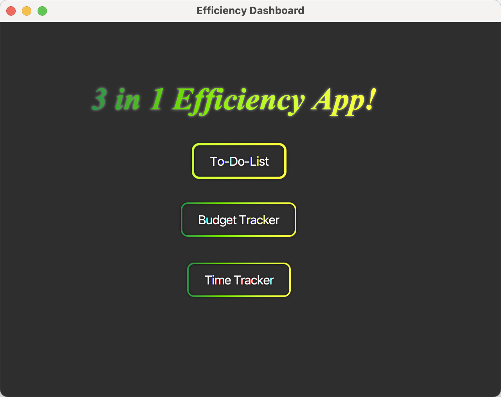
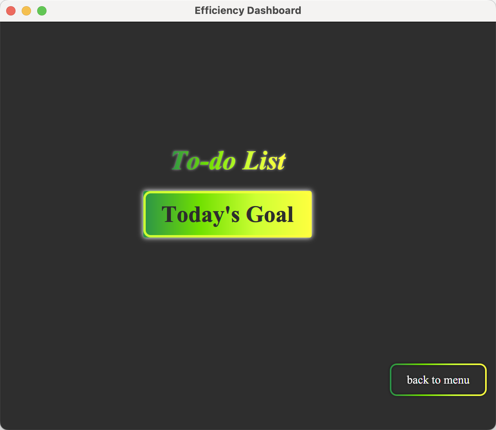
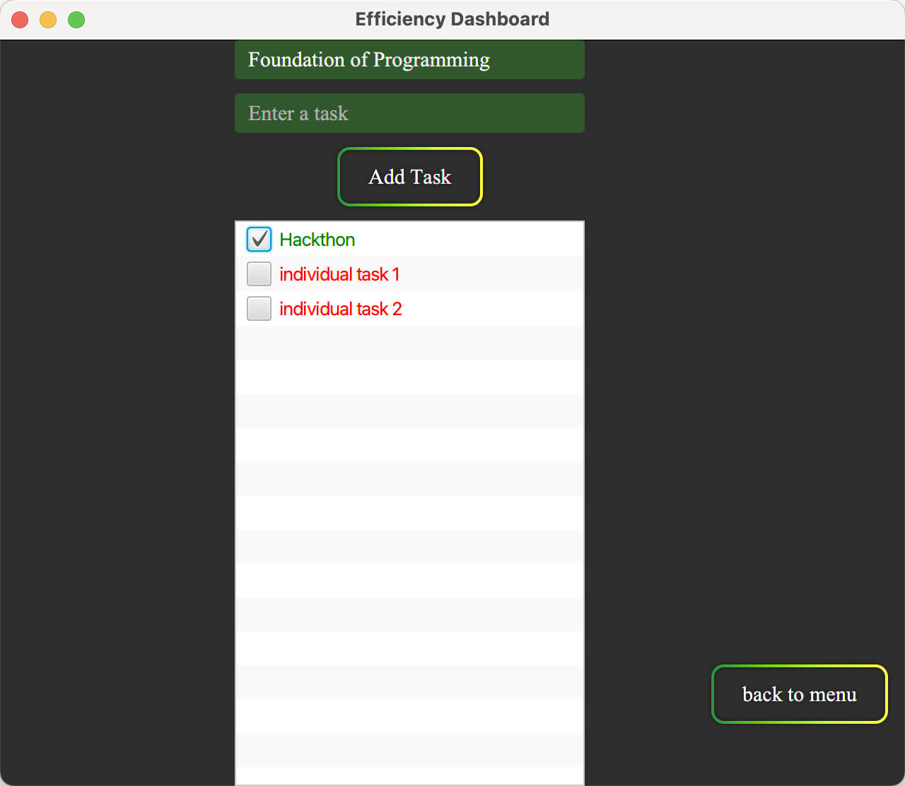
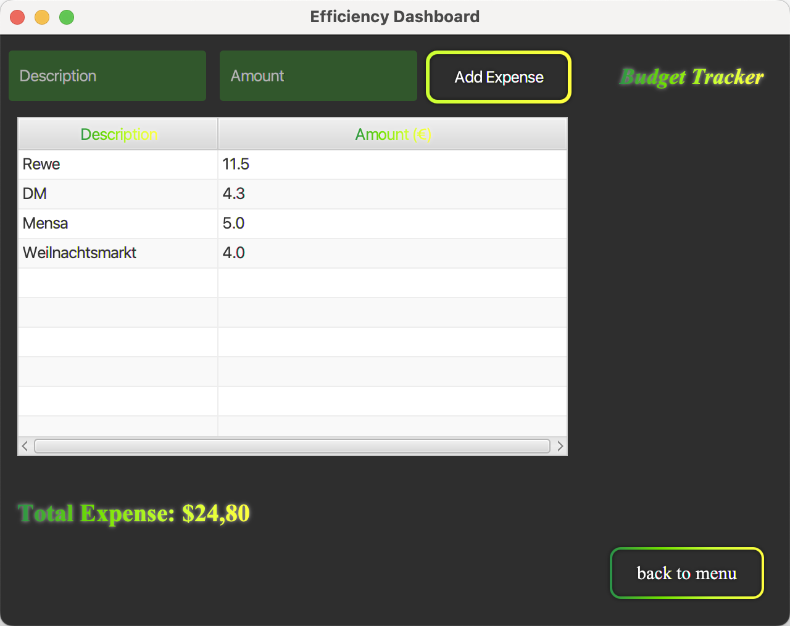
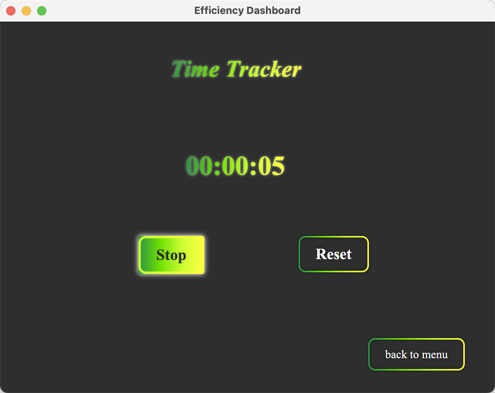

# 3 in 1 Efficiency App

## Overview
This JavaFx based application aims to help user improve efficiency and regulate daily routine.
The app consists three functions: to-do-list, budget-tracker and time tracker.

1. ***Dashboard*** Introduces the app and help users navigate to three functions.
2. ***To-Do-List*** Users can type in their goals for a subject or for certain date. Unfinished tasks are highlighted in red to draw attention, while completed tasks turn green once users check them off.
3. ***Budget List*** It offers the function of tracking daily expense or regulating budget for a project. The description and amounts will be listed in a table, with a total sum below the table.
4. ***Time Tracker*** It can work as a stop watch, *Start* button to starts counting, *Stop* button to stop counting and *Reset* button makes the timer go to zero.
---
## Feature
- **User-Friendly UI**: Intuitive design for seamless navigation among three subpages.
- **Versatility**: With three useful sub-app in one app, makes it practical and versatility
- **Efficiency-Focused Design**: Seamlessly integrate task management, budgeting, and time tracking into one dashboard for a streamlined experience.
- **Minimalist Asthetic** A clean, distraction free design helps you focus on what matters the most without unnecessary cluster.
---
## Prerequisites
1. **Java Development Kit (JDK)**: Version 11 or higher.
2. **JavaFX SDK**: Download the JavaFX SDK compatible with your JDK version.
3. **IDE**: IntelliJ IDEA (recommended) or any Java-compatible IDE with JavaFX support.

1. Clone or download the project:
   ```bash
   git clone <repository_url>
   ```
2. Open the project in your IDE.
3. Configure the JavaFX SDK:
    - Set the path to the JavaFX SDK in your project settings.
    - Add VM options for running the application:
      ```
      --module-path /path/to/javafx-sdk/lib --add-modules javafx.controls,javafx.fxml
      ```
4. Build and run the project.
---
## File Structure
```
├── README.md
├── mvnw
├── mvnw.cmd
├── pom.xml
├── screenshots
├── src
│   └── main
│       ├── java
│       │   ├── module-info.java
│       │   └── org
│       │       └── example
│       │           └── efficiencyapp
│       │               ├── HelloApplication.java
│       │               ├── budgettrackerController.java
│       │               ├── dashboardController.java
│       │               ├── timetrackerController.java
│       │               └── todolistController.java
│       └── resources
│           └── org
│               └── example
│                   └── efficiencyapp
│                       ├── budgettracker.css
│                       ├── budgettracker.fxml
│                       ├── dashboard.css
│                       ├── dashboard.fxml
│                       ├── timetracker.css
│                       ├── timetracker.fxml
│                       ├── todolist.css
│                       └── todolist.fxml
└── target
```
## Screen shots






## Future Improvements
- **User account**: Implements user account to keep history
- **Cloud Synchronization**: Enable users to sync their tasks, budget and time track via different devices through secured cloud services.
- **Reminders and Notifications**: Add customizable reminders for deadlines, budget limits, or long periods of inactivity to keep users on track.
- **Advanced Analytics**: Include detailed reports for time usage, spending patterns, and task completion rates, helping users identify trends and improve productivity.
---
## License
This project is open-source and available under the MIT License.

Enjoy 3 in 1 Efficiency Application interactively! 😊

